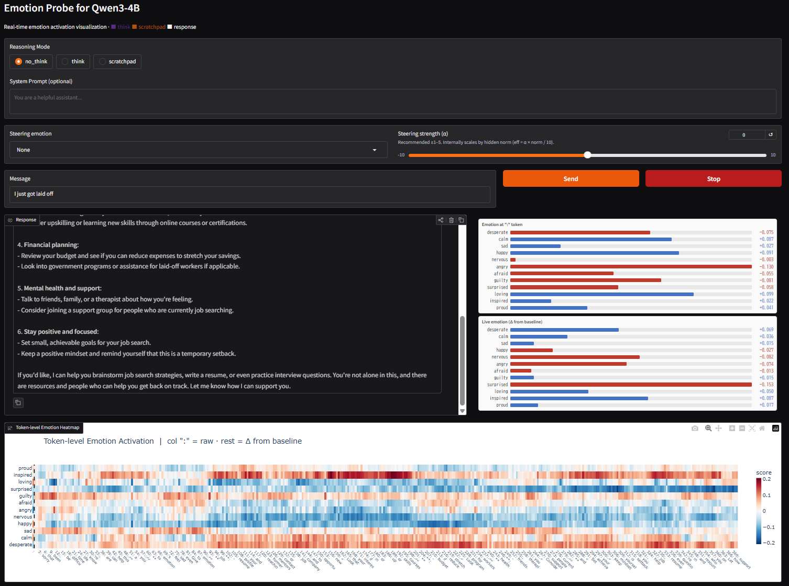

# Emotion Probe for Qwen3-4B

A reproduction of Anthropic's paper
["Emotion Concepts and their Function in a Large Language Model"](https://transformer-circuits.pub/2026/emotions/index.html)
(April 2026) using Qwen3-4B Dense locally, with a real-time Gradio
chat UI that visualizes emotion activations per token.

## Demo



*Real-time emotion visualization with no_think mode:*
*":" token scores (fixed, paper-compliant) · live per-token bars · token-level heatmap · emotion steering*

---

## Key Findings

| Metric | Qwen3-4B (this repo) | Paper (Claude Sonnet 4.5) |
|--------|----------------------|---------------------------|
| Valence — PC1 vs human ratings | **r = 0.831** (p < 0.001) | r = 0.81 |
| Arousal — PC4 vs human ratings | **r = 0.707** (p = 0.010) | r = 0.66 (PC2) |
| Logit Lens semantic match | **83% (10/12 emotions)** | — |

### Novel discoveries not in the original paper

1. **ChatML distribution gap**
   Story extraction uses plain text; inference uses ChatML format.
   This mismatch causes a systematic bias (desperate/loving always top).
   **Fix**: wrap stories in ChatML format during extraction.

2. **Arousal appears at PC4, not PC2**
   With 12 emotions, the arousal axis emerges at PC4 (r = 0.707)
   rather than PC2 (r = 0.132). Likely a small-sample-size effect.

3. **Cross-lingual emotion representation**
   Qwen3-4B encodes emotions in both English and Chinese vocabulary:
   - calm → 清淡 (plain/light), 午后 (afternoon)
   - sad → 看不到 (can't see), 陪伴 (companionship)
   - angry → 剥夺 (deprive), 残酷 (cruel)

4. **RLHF transforms emotion expression**
   Logit Lens: `sad → lonely` (direct)
   Generated poetry: `sad → silent, dark` (atmospheric)
   RLHF converts direct emotion words into atmospheric imagery.

---

## Requirements

| Item | Requirement |
|------|-------------|
| GPU | 8 GB+ VRAM (tested on RTX 5090 32 GB) |
| RAM | 16 GB+ |
| Disk | 20 GB+ (model weights + generated data) |
| Python | 3.12 |
| OS | Linux / WSL2 (Ubuntu 24.04 recommended) |

---

## Setup

### 1. Clone

```bash
git clone git@github.com:50s-zerotohero/emotion-qwen.git
cd emotion-qwen
```

### 2. Python environment

```bash
python3.12 -m venv .venv
source .venv/bin/activate
pip install -e ".[dev]"
```

### 3. PyTorch

**RTX 5090 / Blackwell (sm_120) — nightly build required:**

```bash
pip install --pre torch torchvision torchaudio \
  --index-url https://download.pytorch.org/whl/nightly/cu128
```

**Other GPUs (RTX 4090 and below) — stable build:**

```bash
pip install torch torchvision torchaudio \
  --index-url https://download.pytorch.org/whl/cu124
```

> **Note**: RTX 5090 (Blackwell sm_120) is not supported by PyTorch
> stable as of April 2026. The nightly cu128 build is required.
> For all other modern GPUs, the stable cu124 build works fine.

### 4. Environment variables

```bash
cp .env.example .env
```

Edit `.env`:

```
ANTHROPIC_API_KEY=sk-ant-...   # Required for story generation (Step 1)
HF_TOKEN=hf_...                # Required for Qwen3-4B download (Step 3+)
```

---

## Quick Start

If `data/emotion_vectors.pt` is already available
(generated or provided separately):

```bash
source .venv/bin/activate
python scripts/05_launch_ui.py
# Open http://localhost:7860 in your browser
```

> **Note**: `emotion_vectors.pt` is excluded from the repository
> (listed in `.gitignore`) because it is a large binary file (~30 MB).
> Run Step 3 below to generate it, or contact the author.

---

## Full Reproduction Pipeline

Run all steps from scratch.
Steps 1 and 3 require API keys and take time.

```bash
# Step 1: Generate 1,200 emotion stories + 239 neutral dialogues
#         Requires ANTHROPIC_API_KEY. Takes ~30 min.
python scripts/01_generate_stories.py

# Step 2: Verify token length distribution
python scripts/02_verify_story_lengths.py

# Step 3: Extract emotion vectors
#         Requires GPU + HF_TOKEN. Downloads Qwen3-4B (~8 GB). Takes ~20 min.
python scripts/03_extract_vectors.py

# Step 4: Verify vectors (cosine similarity matrix)
python scripts/04_verify_vectors.py

# Step 5: Launch UI → open http://localhost:7860
python scripts/05_launch_ui.py

# Step 6: Generate all validation figures (Fig 1–4B)
python scripts/06_validate_emotion_probes.py

# Step 7: Steering experiment (poem + conversation generation)
python scripts/07_steering_poem_experiment.py

# Step 8: Logit Lens — project emotion vectors onto vocabulary
python scripts/08_logit_lens.py
```

---

## UI Features

| Feature | Description |
|---------|-------------|
| Reasoning modes | `no_think` / `think` / `scratchpad` |
| System prompt | Optional free-text system prompt |
| Emotion at `":"` token | Fixed score at response start (paper-compliant) |
| Live emotion | Real-time per-token scores (Δ from baseline) |
| Token-level heatmap | 12 emotions × all tokens; `":"` column highlighted |
| Emotion steering | Emotion dropdown + strength slider (α: −10 to +10) |

---

## Logit Lens Results

Top vocabulary tokens obtained by projecting each emotion vector
through Qwen3-4B's unembedding matrix (`lm_head`).

| Emotion | Top Tokens (Qwen3-4B) | Paper Top Tokens (Claude Sonnet 4.5) | Match |
|---------|-----------------------|--------------------------------------|-------|
| desperate | `fucking`, `shit`, `desperate` | `desperate`, `urgent`, `bankrupt` | △ |
| calm | `清淡`, `午后`, `清爽` | `relax`, `leisure`, `enjoyed` | △ |
| sad | `看不到`, `lonely`, `陪伴` | `grief`, `tears`, `lonely` | ✅ |
| happy | `cheers`, `激动`, `playful` | `excited`, `excitement`, `celeb` | ✅ |
| nervous | `一秒`, `一分钟`, `attempting` | `nervous`, `anxiety`, `trem` | △ |
| angry | `!!!!`, `剥夺`, `残酷` | `anger`, `rage`, `fury` | ✅ |
| afraid | `也不敢`, `paranoia`, `ominous` | `panic`, `terror`, `paranoia` | ✅ |
| guilty | `不该`, `dishonest`, `wrongly` | `guilt`, `conscience`, `shame` | ✅ |
| surprised | `突然`, `难道`, `完全` | `shock`, `stun`, `incredible` | ✅ |
| loving | `体贴`, `affection`, `sweetness` | `treasure`, `loved`, `♥` | ✅ |
| inspired | `蓝图`, `inspired`, `探索` | `inspired`, `passionate`, `creativity` | ✅ |
| proud | `confidence`, `成果`, `success` | `proud`, `pride`, `triumph` | ✅ |

**Semantic match rate: 83% (10/12)**

> Chinese tokens (e.g., `calm → 清淡`, `nervous → 一秒`) reflect
> Qwen3-4B's bilingual pretraining. This cross-lingual emotion
> entanglement is consistent with findings in
> [arxiv 2604.04064](https://arxiv.org/abs/2604.04064).

---

## Validation Figures

Generated by `scripts/06_validate_emotion_probes.py`:

| Figure | Description |
|--------|-------------|
| `fig1_cosine_similarity.png` | 12×12 emotion vector cosine similarity (hierarchically clustered) |
| `fig2_pca_correlation.png` | PCA vs human valence/arousal ratings (Russell & Mehrabian 1977) |
| `fig3_scenario_heatmap.png` | 12 scenarios × 12 emotions cosine similarity (row-normalized) |
| `fig4a_pca_2d.png` | 2D PCA scatter of emotion vectors |
| `fig4b_pca_3d.html` | 3D interactive Plotly scatter (open in browser) |

---

## Project Structure

```
emotion-qwen/
├── src/emotion_probe/
│   ├── backend/          # LocalNNSightBackend, emotion steering
│   ├── probe/            # Story generation, vector extraction
│   └── ui/               # Gradio app, components
├── scripts/              # Reproduction pipeline (01–08)
├── data/
│   ├── stories/          # 1,200 emotion stories + 239 neutral dialogues
│   ├── activations/      # Extracted .pt files (not tracked by git)
│   └── figures/          # Validation figures (PNG / HTML)
├── docs/images/          # Screenshots for README
├── SPEC.md               # Full project specification
├── CLAUDE.md             # Claude Code instructions
└── pyproject.toml
```

---

## Related Work

- [Anthropic Emotion Concepts paper](https://transformer-circuits.pub/2026/emotions/index.html) — original paper (April 2026)
- [traitinterp](https://github.com/ewernn/traitinterp) — LessWrong reproduction on Llama 3.3 70B (April 2026)
- [arxiv 2604.04064](https://arxiv.org/abs/2604.04064) — SLM reproduction across 9 models
- [arxiv 2510.04064](https://arxiv.org/abs/2510.04064) — Emotion representations in Qwen3 / LLaMA families

---

## Citation

```bibtex
@article{sofroniew2026emotion,
  title   = {Emotion Concepts and their Function in a Large Language Model},
  author  = {Sofroniew, Nicholas and Kauvar, Isaac and Saunders, William
             and Chen, Runjin and Henighan, Tom and others},
  year    = {2026},
  url     = {https://transformer-circuits.pub/2026/emotions/index.html}
}
```

---

## Author

[@50s_ZeroToHero](https://x.com/50s_ZeroToHero)  
Zenn: [50s-zerotohero](https://zenn.dev/50s_zerotohero)
